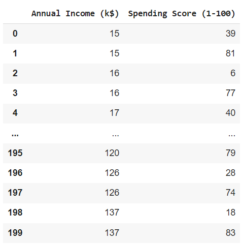
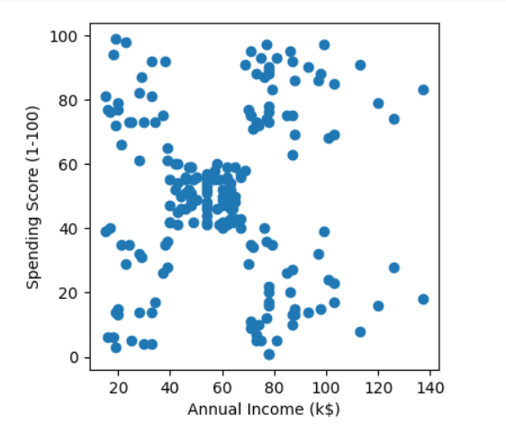
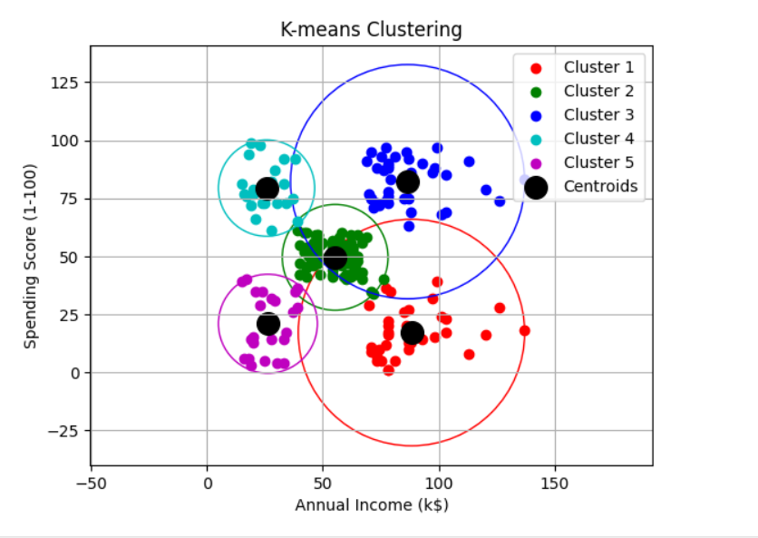

# Implementation-of-K-Means-Clustering-for-Customer-Segmentation

## AIM:
To write a program to implement the K Means Clustering for Customer Segmentation.

## Equipments Required:
1. Hardware – PCs
2. Anaconda – Python 3.7 Installation / Jupyter notebook

## Algorithm
1. Pick customer segment quantity (k).
2. Seed cluster centers with random data points.
3. Assign customers to closest centers. 
4. Re-center clusters and repeat until stable.

## Program:
```
/*
Program to implement the K Means Clustering for Customer Segmentation.
Developed by: SANIYA G
RegisterNumber:  212223240147
*/

import pandas as pd
import numpy as np
from sklearn.cluster import KMeans
from sklearn.metrics.pairwise import euclidean_distances
import matplotlib.pyplot as plt

data = pd.read_csv("/content/Mall_Customers_EX8.csv")
data

X = data[['Annual Income (k$)' , 'Spending Score (1-100)']]
X

plt.figure(figsize=(4,4))
plt.scatter(data['Annual Income (k$)'], data['Spending Score (1-100)'])
plt.xlabel('Annual Income (k$)')
plt.ylabel("Spending Score (1-100)")
plt.show()

k = 5
kmeans = KMeans(n_clusters=k)
kmeans.fit(X)

centroids = kmeans.cluster_centers_
labels = kmeans.labels_
print("Centroids: ")
print(centroids)
print("Label:")
print(labels)

colors = ['r', 'g', 'b', 'c', 'm']


for i in range(k):
  cluster_points = X[labels == i]
  plt.scatter(cluster_points['Annual Income (k$)'], cluster_points['Spending Score (1-100)'], color=colors[i], label=f'Cluster {i+1}')

  
  distances = euclidean_distances(cluster_points, [centroids[i]])
  radius = np.max(distances)

  circle = plt.Circle(centroids[i], radius, color=colors[i], fill=False)
  plt.gca().add_patch(circle)


plt.scatter(centroids[:, 0], centroids[:, 1], marker='o', s=200, color='k', label='Centroids')

plt.title('K-means Clustering')
plt.xlabel("Annual Income (k$)")
plt.ylabel('Spending Score (1-100)')
plt.legend()
plt.grid(True)
plt.axis('equal') 
plt.show()
```

## Output:
# Head:

# X value:

# Plot:

# Centroid and Label:

# K-means clustering:


## Result:
Thus the program to implement the K Means Clustering for Customer Segmentation is written and verified using python programming.
